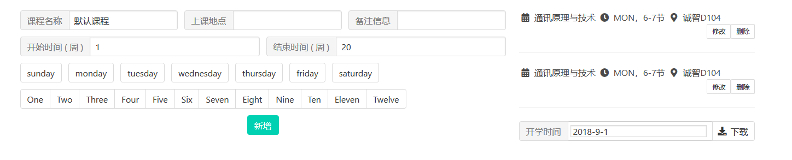

# schedule-to-google-calendar
编辑课程表，然后导入到Google日历。



[demo](https://yee2.github.io/schedule-to-google-calendar/)
## Project setup
```
npm install
```

### Compiles and hot-reloads for development
```
npm run serve
```

### Compiles and minifies for production
```
npm run build
```

### Lints and fixes files
```
npm run lint
```
 
